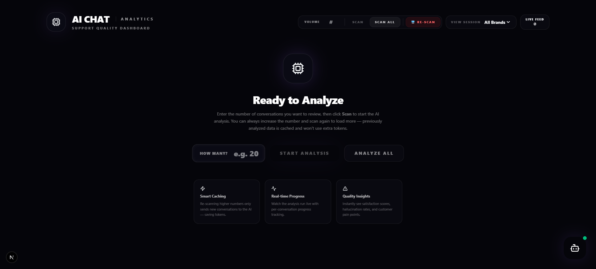
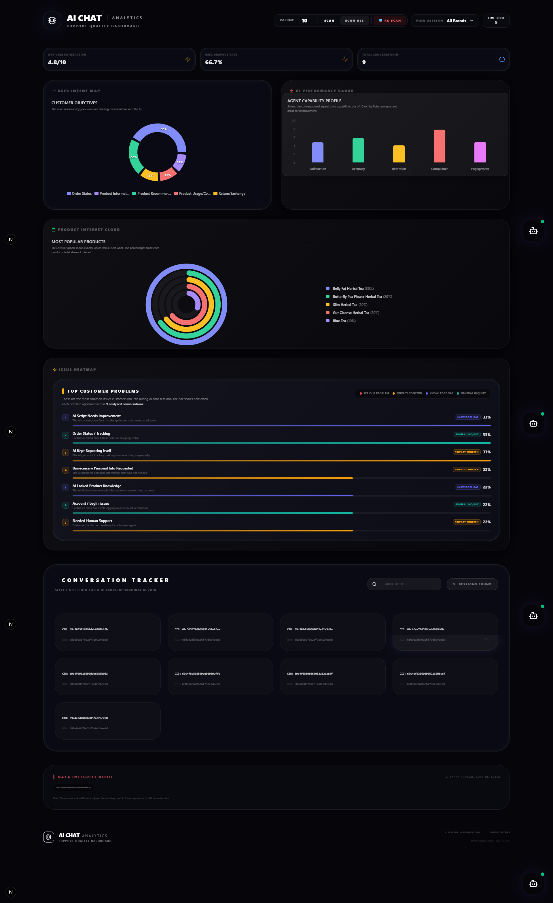
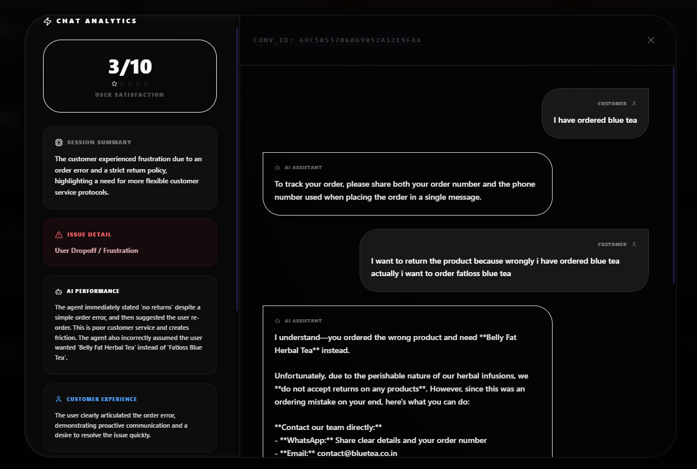
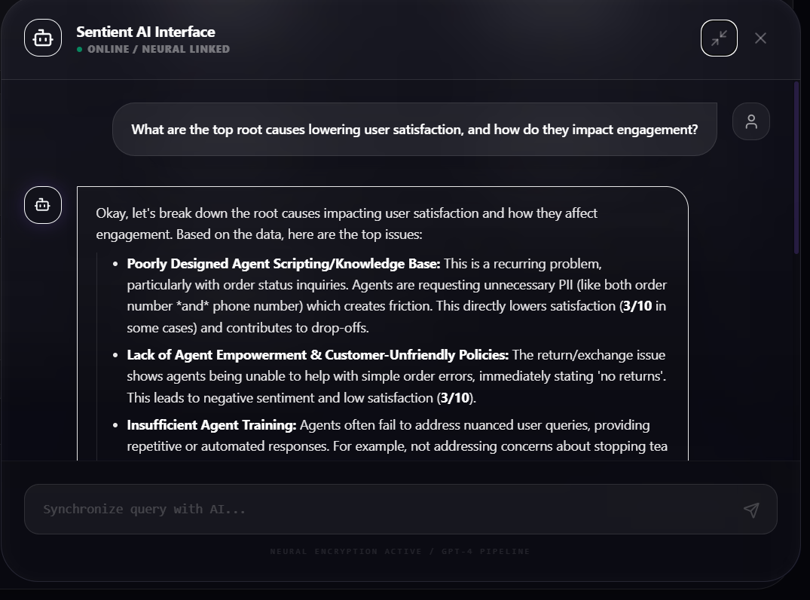
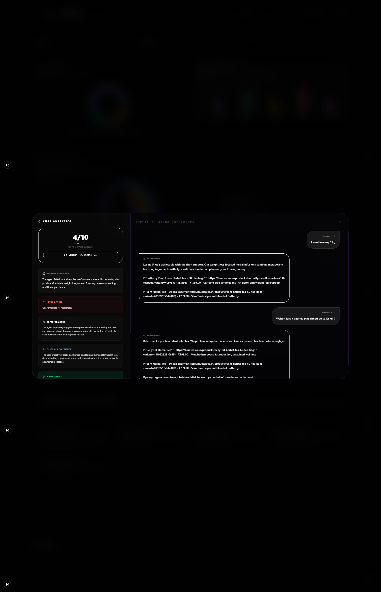
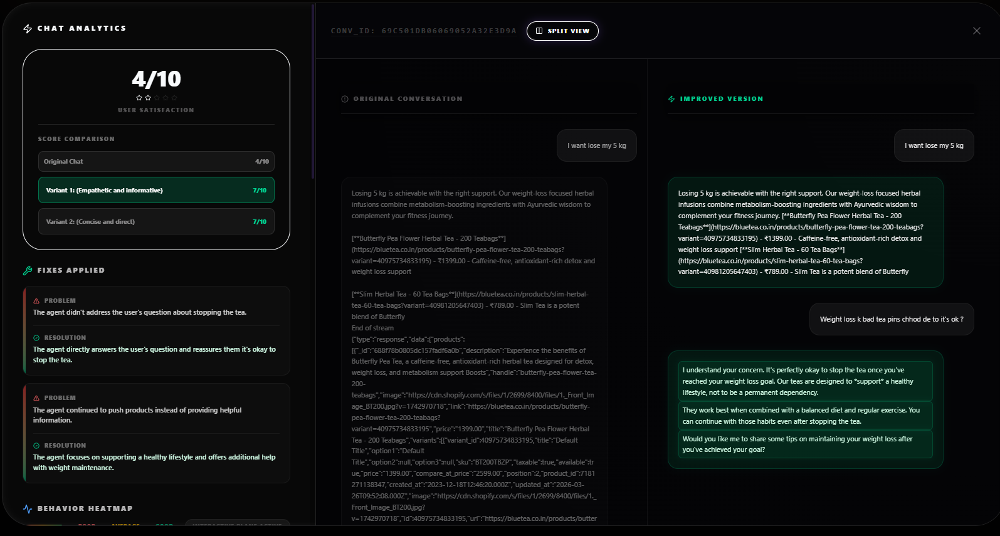
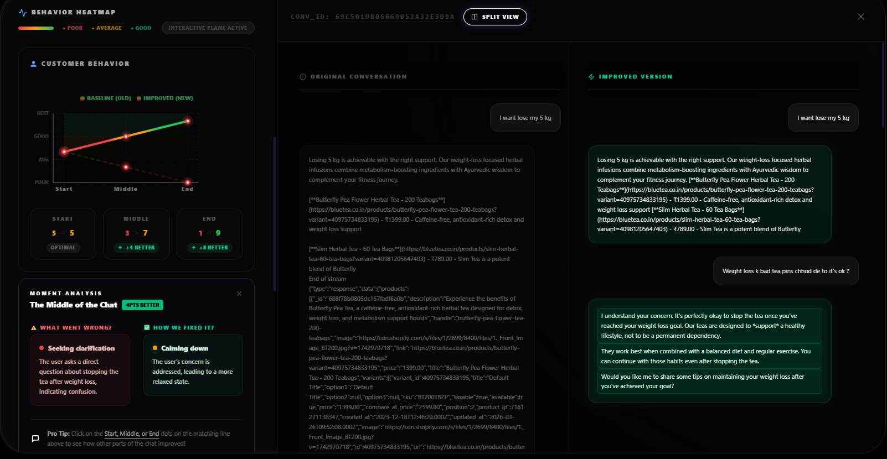
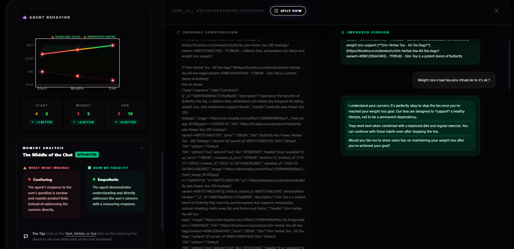

# 🌌 Nvn..B OS: AI-Powered Behavioral Analytics & QA Suite


**Nvn..B OS** is a premium, beautifully designed AI Quality Assurance (QA) and Behavioral Analytics platform. Built for e-commerce, it transforms raw customer chats into easy-to-understand intelligence reports. It helps you instantly see where customers get frustrated, flags security risks, and even shows you exactly how the AI *should* have responded to save the sale!

---

## 🔥 Magical Features (Explained Simply!)

### 🛒 Live AI Shopping Assistant (The Chatbot)
A built-in, intelligent customer service window that helps users find products, answers their questions, and adds items directly to their cart. Every conversation here is recorded and sent to the analytical brain for review.

### 🧠 The Analytics Dashboard
A stunning glass-like interface that takes hundreds of chat logs and turns them into visual data you can actually understand at a glance:
- **Model Weakness Radar:** A 5-point graph showing how happy customers are, how accurate the AI is, and whether the AI is breaking any rules.
- **Issue Density Heatmap:** Colorful boxes that show you exactly what problems happen most frequently (e.g., "Checkout Issues" or "Irrelevant Products").

### ⚡ Auto-Generate Better Scenarios (AI Self-Correction)
If a chat goes poorly and a customer drops off, simply click **"Auto-Generate Better Scenarios"**. 
Our powerful backend AI (Gemma-3) will instantly rewrite the conversation, showing you a side-by-side split screen of what the chatbot *did* say versus what it *should have* said to make the customer happy.

### 📍 Deep-Dive Behavior Heatmap 
We don't just give you a single score. Our system charts the entire emotional journey of the chat from **Start → Middle → End**. The lines on the graph even change from Red (Angry) to Green (Happy) as the conversation improves!

### 🔍 "Moment" Analysis (Plain English Insights)
Don't want to read a 50-page technical log? Just click a dot on the Heatmap! The system will pop open a beautifully designed card explaining exactly what happened in **simple, everyday language**:
- **What Went Wrong:** e.g., *"The user was frustrated because the agent didn't understand the refund policy."*
- **How We Fixed It:** e.g., *"The new version remained calm and offered an instant store credit, saving the interaction."*

### 🛡️ Security & Compliance Alerts
Every single message is scanned for danger. If a chat leaks personal data, violates brand policy, or shares an unsafe link, a bright orange **Security Warning** badge will instantly pop up in the analytics telling you exactly what went wrong.

---

## 🏛️ How It Works (Behind the Scenes)

1. **The Backend (FastAPI):** Gathers the chats and sends them to our massive AI brain (Gemma 3 27B). It breaks down the conversation logically without hardcoding anything.
2. **The Evaluator:** Scans the text for hallucinations, missed sales, and user frustration.
3. **The Simulator:** Creates a "perfect" version of the conversation that fixes the mistakes from the original.
4. **The Frontend (Next.js):** Displays these highly complex AI operations using gorgeous colors, floating notifications, and effortless side-by-side comparison tables.

---

## 🛠️ Tech Stack

- **Core**: Python (FastAPI), React (Next.js 14)
- **AI/LLM**: Google Generative AI Engine (Gemma 3 / Gemini Pro)
- **Styling**: Tailwind CSS, Framer Motion (Animations), Glassmorphic UI
- **Database**: MongoDB (Atlas) for persistent chat history and AI results

---

## 🚀 Installation & Local Setup

### **Prerequisites**
- Python 3.9+ 
- Node.js 18+ 
- MongoDB URI & Google Gemini API Key

### **Step 1: Cloning the Project**
```bash
git clone https://github.com/Bhartinaveen/aiassistance.git
cd aiassistance/scaling-palm-tree
```

### **Step 2: Backend Configuration**
1. Navigate to the backend folder:
   ```bash
   cd backend
   ```
2. Create and activate a virtual environment:
   ```bash
   py -m venv .venv
   .venv\Scripts\activate  # Windows
   # source .venv/bin/activate  # Linux/Mac
   ```
3. Install dependencies:
   ```bash
   pip install -r requirements.txt
   ```
4. Create a `.env` file and add your keys:
   ```env
   GEMINI_API_KEY=your_gemini_key_here
   MONGO_URI=your_mongo_connection_string
   ```
5. Launch the exact backend brain:
   ```bash
   uvicorn app.main:app --reload
   ```

### **Step 3: Frontend Configuration**
1. Open a new terminal in the frontend folder: 
   ```bash
   cd frontend 
   ```
2. Install dependencies:
   ```bash
   npm install
   ```
3. Start the visual dashboard:
   ```bash
   npm run dev
   ```

Open [http://localhost:3000](http://localhost:3000) to view the **Nvn..B OS** Dashboard.

---

## 📸 Project Gallery

### Landing page


### Dashboard Overview


### Deep-Dive Chat Analysis


### AI Agent Chat with User


## new autogenerate chat






---
© 2026 **Nvn..B RESEARCH LABS** // All Rights Reserved
