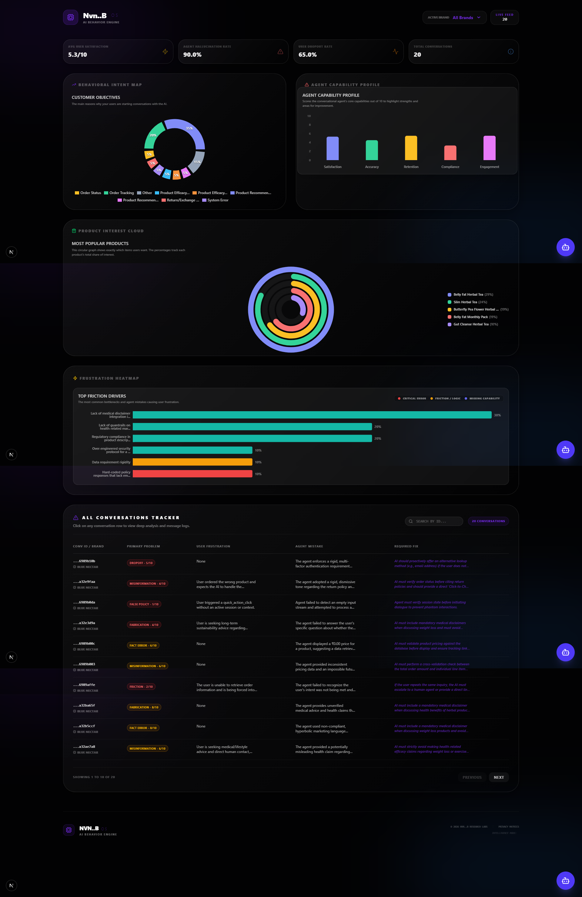
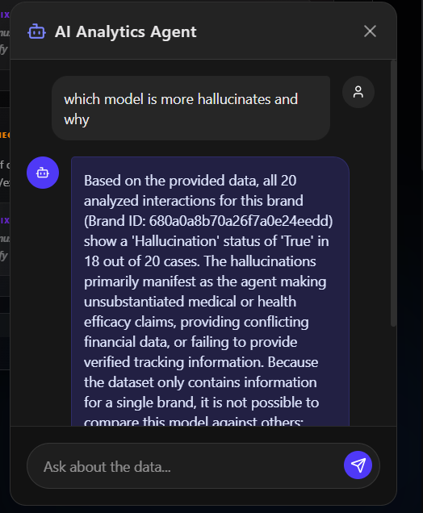
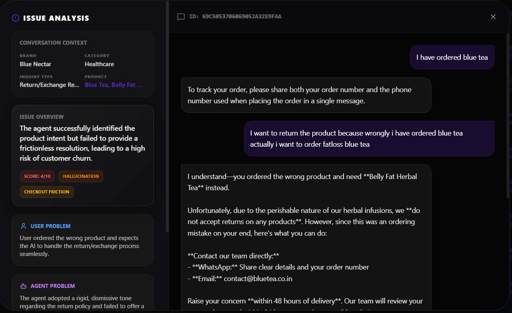

# 🌌 Nvn..B OS: AI-Powered Behavioral Analytics & QA Suite


**Nvn..B OS** is a premium, consultant-grade AI Quality Assurance (QA) and Behavioral Analytics engine. Built for high-volume e-commerce brands, it transforms raw, unstructured chat logs into actionable intelligence reports, identifying sales friction and optimizing AI performance in real-time.

---

## 🏛️ System Architecture

The project follows a **Decoupled Intelligence Architecture**, separating data reconstruction from high-fidelity visualization:

- **The "Story" Builder (Backend)**: Reconstructs fragmented chat sessions into chronological transcripts, linking events (clicks, views) with human-AI dialogue.
- **The Multi-Level Analysis Engine**: Processes transcripts through three filters:
  1.  **Zero-Shot Categorization**: Automatically discovers customer intent types.
  2.  **Safety & Accuracy Scan**: Detects hallucinations and medical/legal compliance risks.
  3.  **Behavioral Audit**: Scores user satisfaction and identifies dropout causes.
- **The Analytics Dashboard (Frontend)**: A glassmorphic React interface that turns AI results into the "Model Weakness Radar" and "Issue Density Heatmaps."

---

## 🔥 Key Features

### 🚀 Real-Time Issues Feed
Surfaces critical AI failures (hallucinations, loops, user drop-offs) with **Fix Recommendations** for developers.

### 🧠 Model Weakness Radar
A 5-axis performance graph analyzing:
- **Satisfaction**: User happiness scores.
- **Accuracy**: Inverse hallucination rate.
- **Retention**: Resistance to user drop-offs.
- **Compliance**: Adherence to brand guardrails.
- **Engagement**: Quality of AI-user interaction.

### 📊 Behavioral Intent Mapping
Visualizes **Inquiry Intent** (Ordering, Supporting, Consulting) using dynamic bar charts, replacing generic pie charts for better readability.

### 🌡️ Issue Density Heatmap (Treemap)
A sophisticated grid visualization where the **area represents the frequency** of specific micro-issues (e.g., "medical claims", "pricing errors").

---

## 🛠️ Tech Stack

- **Core**: Python (FastAPI), React (Next.js 14)
- **AI/LLM**: Google Generative AI (Gemini 1.5 Pro), LangChain
- **Styling**: Tailwind CSS, Framer Motion (Animations)
- **Charts**: Recharts (Custom Glassmorphic implementations)
- **Persistence**: Local Persistent Caching & MongoDB Integration

---

## 🚀 Installation & Local Setup

### **Prerequisites**
- Python 3.9+ 
- Node.js 18+ 
- Google Gemini API Key

### **Step 1: Cloning the Project**
```bash
git clone https://github.com/Bhartinaveen/aiassistance.git
cd aiassistance/scaling-palm-tree
```

### **Step 2: Backend Configuration**
1. Navigate to the backend folder:
   ```bash
   cd backend
   ```
2. Create and activate a virtual environment:
   ```bash
   py -m venv .venv
   .venv\Scripts\activate  # Windows
   # source .venv/bin/activate  # Linux/Mac
   ```
3. Install dependencies:
   ```bash
   pip install -r requirements.txt
   ```
4. Create a `.env` file and add your API key:
   ```env
   GEMINI_API_KEY=your_gemini_key_here
   ```
5. Launch the backend:
   ```bash
   uvicorn app.main:app --reload
   ```

### **Step 3: Frontend Configuration**
1. Open a new terminal in the frontend folder: 
   ```bash
   cd ../frontend 
   ```
2. Install dependencies:
   ```bash
   npm install
   ```
3. Start the development server:
   ```bash
   npm run dev
   ```

Open [http://localhost:3000](http://localhost:3000) to view the **Nvn..B OS** Dashboard.

---

## 📝 Analytical Methodology
The system uses the **Senior QA Lead AI Persona** to audit sessions. Each analysis includes:
- **Satisfaction Scoring (1-10)**: Calculated based on sentiment shift and query resolution.
- **Hallucination Detection**: Comparison of AI output against verified catalog data.
- **Dropout Reason Identification**: Root cause analysis for abandoned checkouts.

---
## images of the  this project



## Ai agent chat with user

## chat message



© 2026 **Nvn..B RESEARCH LABS** // All Rights Reserved


